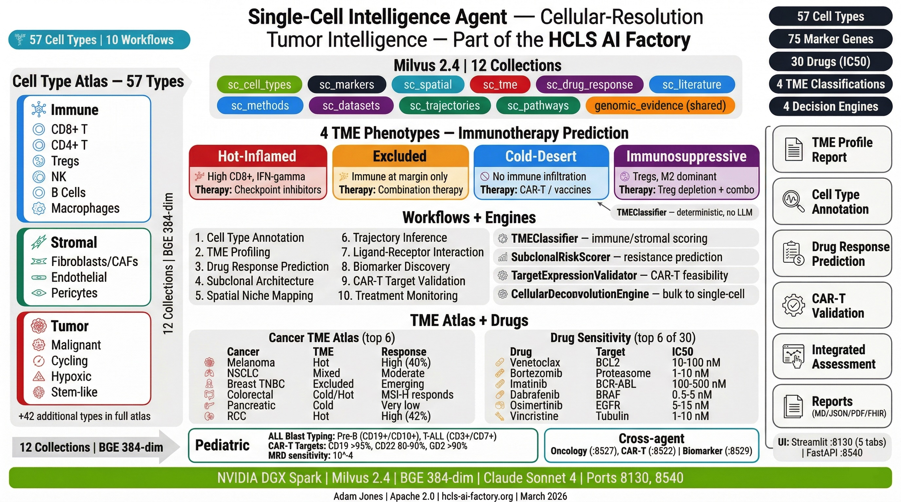

# Single-Cell Intelligence Agent




*Source: [single-cell-intelligence-agent](https://github.com/ajones1923/single-cell-intelligence-agent)*

RAG-powered single-cell genomics clinical decision support agent for the HCLS AI Factory.

## Features

- **Cell Type Annotation** -- Multi-strategy annotation using reference-based, marker-based, and LLM-augmented approaches
- **TME Profiling** -- Tumor microenvironment classification (hot/cold/excluded/immunosuppressive)
- **Drug Response Prediction** -- Cell-type-resolved drug sensitivity using GDSC/DepMap signatures
- **Subclonal Architecture** -- CNV-based subclonal detection with antigen escape risk assessment
- **Spatial Niche Mapping** -- Spatial transcriptomics niche identification (Visium, MERFISH, Xenium, CosMx)
- **Trajectory Inference** -- Pseudotime analysis with branch point detection and driver gene identification
- **Ligand-Receptor Interaction** -- Cell-cell communication network analysis (CellPhoneDB/NicheNet)
- **Biomarker Discovery** -- Differential expression-based biomarker identification with clinical correlation
- **CAR-T Target Validation** -- On-tumor/off-tumor expression assessment with escape risk analysis
- **Treatment Monitoring** -- Longitudinal tracking of treatment response and resistance emergence

## Architecture

| Component | Port | Description |
|-----------|------|-------------|
| FastAPI   | 8540 | REST API server |
| Streamlit | 8130 | Interactive UI |
| Milvus    | 69530 | Vector database (standalone) |

## Quick Start

```bash
cp .env.example .env          # Set ANTHROPIC_API_KEY
docker compose up -d           # Start all services
docker compose logs -f sc-setup  # Watch seed progress
```

## Development

```bash
pip install -r requirements.txt

# Start API
uvicorn api.main:app --host 0.0.0.0 --port 8540 --reload

# Start UI
streamlit run app/sc_ui.py --server.port 8130
```

## API Endpoints

### System
- `GET /health` -- Service health
- `GET /collections` -- Milvus collections
- `GET /workflows` -- Available workflows
- `GET /metrics` -- Prometheus metrics

### Single-Cell Analysis (prefix: `/v1/sc`)
- `POST /v1/sc/query` -- RAG Q&A
- `POST /v1/sc/search` -- Multi-collection search
- `POST /v1/sc/annotate` -- Cell type annotation
- `POST /v1/sc/tme-profile` -- TME profiling
- `POST /v1/sc/drug-response` -- Drug response prediction
- `POST /v1/sc/subclonal` -- Subclonal analysis
- `POST /v1/sc/spatial-niche` -- Spatial niche mapping
- `POST /v1/sc/trajectory` -- Trajectory inference
- `POST /v1/sc/ligand-receptor` -- Ligand-receptor interaction
- `POST /v1/sc/biomarker` -- Biomarker discovery
- `POST /v1/sc/cart-validate` -- CAR-T target validation
- `POST /v1/sc/treatment-monitor` -- Treatment monitoring
- `POST /v1/sc/workflow/{type}` -- Generic workflow dispatch
- `GET /v1/sc/cell-types` -- Cell type catalogue
- `GET /v1/sc/markers` -- Marker gene reference
- `GET /v1/sc/tme-classes` -- TME classification reference
- `GET /v1/sc/spatial-platforms` -- Spatial platform reference
- `GET /v1/sc/knowledge-version` -- Knowledge version

### Reports & Events
- `POST /v1/reports/generate` -- Report generation
- `GET /v1/reports/formats` -- Supported formats
- `GET /v1/events/stream` -- SSE event stream

## Tech Stack

- **API:** FastAPI + Uvicorn
- **UI:** Streamlit (NVIDIA dark theme)
- **Vector DB:** Milvus 2.4
- **Embeddings:** BGE-small-en-v1.5
- **LLM:** Claude (Anthropic)
- **Knowledge:** 32 cell types, 22 drugs, 55 markers, 4 spatial platforms

## Author

Adam Jones -- HCLS AI Factory, March 2026

## License

This project is licensed under the [Apache License 2.0](LICENSE).
